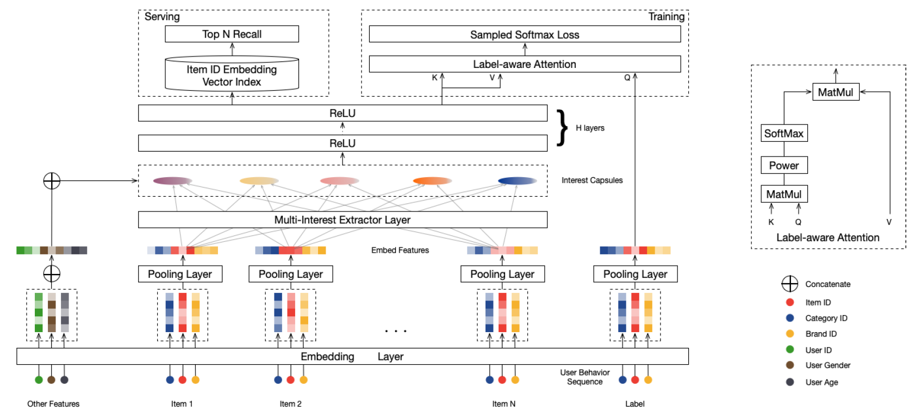
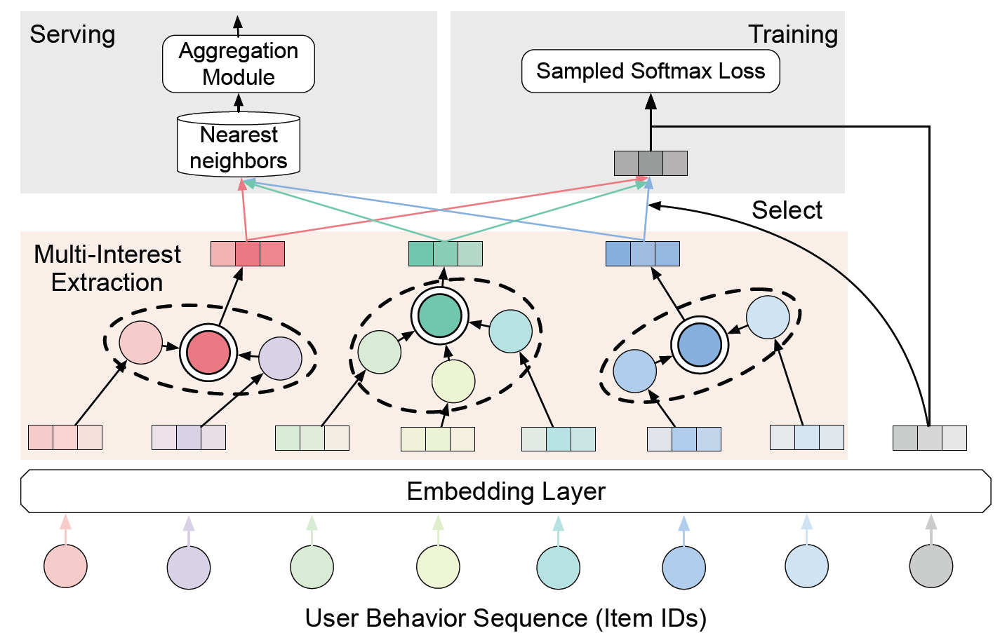
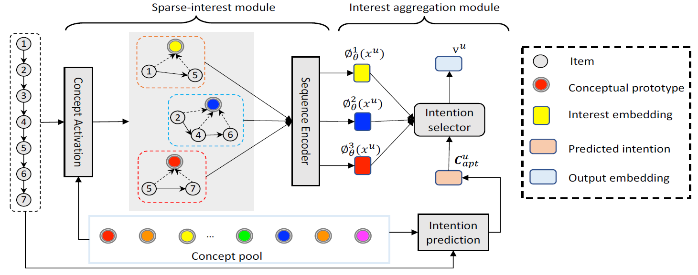
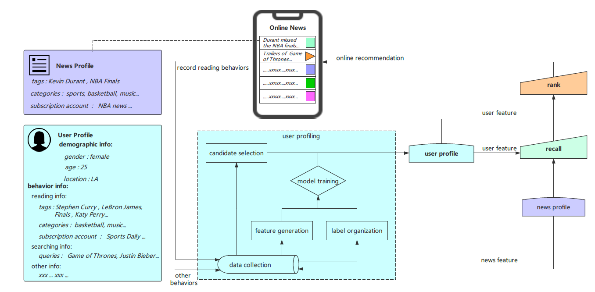
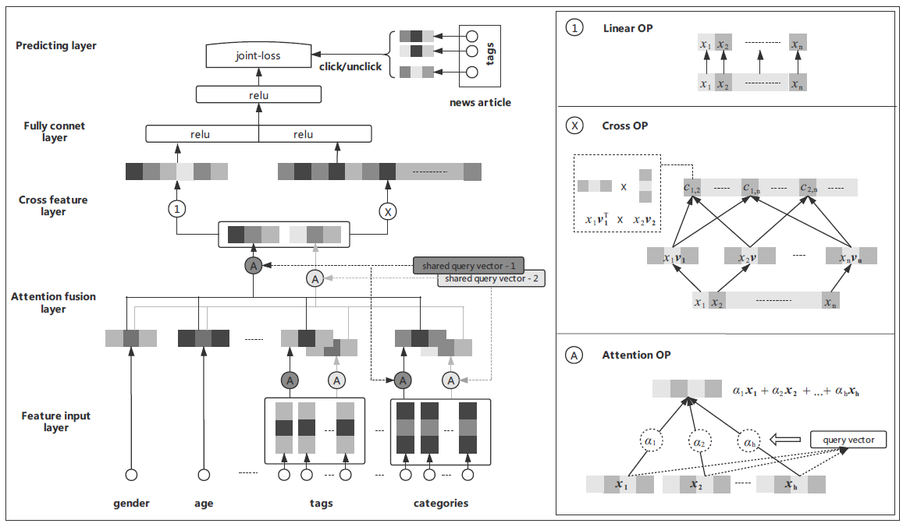
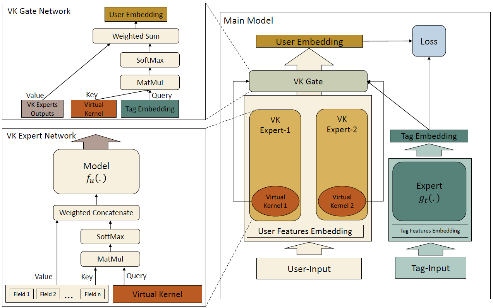
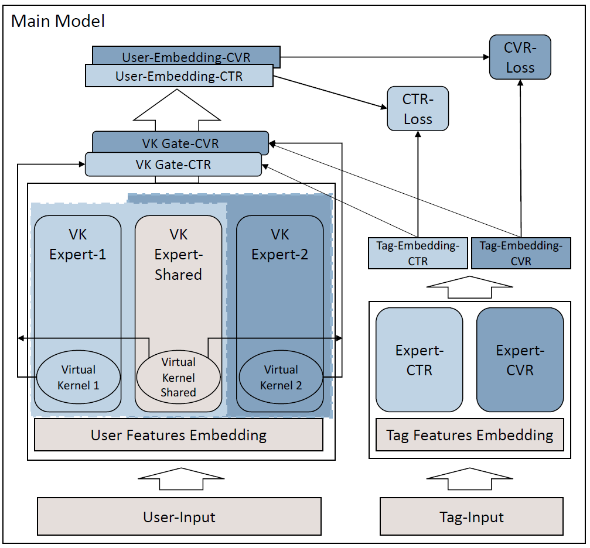

# Multi-Interest Learning
implicit approach：隐式地聚类user behavior提取兴趣(MIND, ComiRec)

explicit approach：构建一个兴趣池(1000~5000), 根据用户历史行为, 利用attention mechanism显式激活部分兴趣(4~8) (SINE, Octopus)

# Capsule Network & Dynamic Routing

## Capsule Network

类似fc layer的加权求和，但元素是向量

- 投影：$u_i = w_iv_i$，$w_i$ learnable params
- 加权：$s = \sum_ic_iu_i$
- Squash：$v = \mathrm{Squash}(s) = \frac{\Vert s\Vert^2}{1+\Vert s\Vert^2}\cdot\frac{s}{\Vert s\Vert} $
  - 前半部分：引入非线性，$\Vert s\Vert$接近0时整个式子接近0；$\Vert s\Vert$越大，整个式子接近1。类似Sigmoid
  - 后半部分：归一化
  - 作用：向量筛选，让短向量缩放到接近0，长向量缩放到接近1

## Dynamic Routing
low-level：$c_i^l\in\mathbb R^{N_l\times 1}\quad i={1, \cdots, m}$

high-level：$c_j^h\in\mathbb R^{N_n\times 1}\quad j={1, \cdots, n}$

### algorithm

input：behavior embeddings $e_i$

output：interest capsules $u_j$

calculate capsules K：$K_u'=\max(1, \min(K, \log_2(|I_u|)))$

initialize routing logits $b_{ij}\sim\mathcal N(0, \sigma^2)$

for $k\leftarrow 1,\ r$ do

$\quad$for all behavior capsule $i$：$w_{ij}\leftarrow\mathrm{Softmax}(b_{ij})$

$\quad$for all interest capsule $j$：$z_j = \sum{i\in\mathbb I_u}w_{ij}Se_i$

$\quad$for all interest capsule $j$：$u_j = \mathrm{Squash}(z_j)$

$\quad$for all behavior capsule $i$ and interest capsule $j$：$b_{ij}\leftarrow u_jSe_i$

end for

return $\{u_j, j=1, \dots, K_u'\}$

- $b_{ij}$：表征behavior embedding $i$相对于interest capsule $j$的相关程度
- 该过程中，与$u_j$最相关的$e_i$，$u_jSe_i$内积越大，$b_{ij}$越大，在下轮迭代中更占主导。$c_j$会慢慢靠近更相关的$e_i$，远离不相关的$e_i$。

# MIND

> Multi-Interest Network with Dynamic Routing for Recommendation @ Tmall (CIKM'19 Alibaba)

学习目标：$V_u=f_{user}(\mathcal I_u, \mathcal P_u)$

- $\mathcal I_u$：user behavior
- $\mathcal P_u$：user profile

$e_i=f_{item}(\mathcal F_i)$，where  $\mathcal F_i$：item label

使用：$f_{score}(V_u, e_i)=\max e_i^Tv_u^k$

## Embedding & Pooling Layer

用户特征、用户行为 -> embedding

输入：user profile、 user behavior、 label对应的target item

## Multi-Interest Extractor Layer

胶囊网络的Dynamic Routing的特性对item做聚类

聚类后的k个embedding分别和user profile的embedding做concat，过一个投影->用户的多个兴趣embedding

## Label-aware Attention Layer

对于target item，可以通过attention mechanism聚合用户的多个兴趣embedding，得到用户最终的embedding
$$
v_u = \mathrm{Attention}(e_i, V_u, V_u) = V_u\mathrm{Softmax}(\mathrm{pow}(V_u^Te_i, p))
$$
其中$p$为超参数，$p$取0为平均，$p$取$+\infty$为one-hot

==先聚合，再召回==

## Training

目标是$v_u$情况下，用户是否会和$e_i$交互
$$
\mathrm{Pr}(i|u)=\mathrm{Pr}(e_i|v_u)=\frac{\exp(v_u^Te_i}{\sum_{j\in\mathcal I}\exp(v_u^Te_i)}\
 L = -\sum_{(u, i)\in\mathcal D}\log\mathrm{Pr}(i|u)
$$
问题：用target label的方式训练存在训练测试不一致问题(偷看答案)

应用：学到的embed可以做召回，整个模型可以做精排

## Serving

离线计算：每隔一段时间根据交互数据更新user的多个兴趣embedding并发布

线上召回：分区，用k近邻算用户向量所在的区块，再遍历区块算兴趣分，排序的topN去recall

# ComiRec

> Controllable Multi-Interest Framework for Recommendation(SIGKDD'20 Alibaba) 

## Embedding Layer

item IDs -> item Embeddings

## Multi-Interest Extraction

item Embeddings -> user interest Embeddings

- ComiRec-DR 用Dynamic Routing做Extraction，见MIND
- ComiRec-SA 用Self Attention做Extraction

Self Attention:
$$
a = \mathrm{Softmax}(w_2^T\tanh(W_1H))^T
$$
- $H\in\mathbb R^{d\times n}$ user behaviors, where $d$: embedding length，$n$: user sequence length
- $w_2^{d_a\times 1}, W_1^{d_a\times d}$ learnable params
- $a^{n\times 1}$ attention weight
- $H$ + learnable PE

since, user interest can be represented as $v_u=Ha$

multi-interest self attention：

做多次attention：$W_2^{d_a\times K}$
$$
A = \mathrm{Softmax}(W_2^Ttanh(W_1H))^T\
 V_u = HA
$$
## Aggregation Module

$$
f(u, i)=\max_{1\le k\le K}(e_i^Tv_u^{(k)})
$$

可以增加一个函数$g$表示多样性:
$$
Q(u, \mathcal S)=\sum(i\in\mathcal S)f(u, i) + \lambda\sum_{i\in\mathcal S}\sum_{j\in\mathcal S}g(i, j)\\
g(i, j) = \delta(\mathrm{CATE}(i)\not=\mathrm{CATE}(j))
$$

$\delta$是指示函数，$\mathrm{CATE}$表示item的分类

## Training

和目标embedding最相似的兴趣embedding会被挑选出来做sampled softmax, greedy训练更快

## Serving

每个兴趣embedding找出和它最相近的topN items，然后放入aggregation模块，选出最终的topN recall

==先召回，再聚合==

# SINE

> Sparse-Interest Network for Sequential Recommendation (WSDM'21 Alibaba) 

利用概念原型对item进行大量聚类

一个人只和一组稀疏概念交互，需要从全量概念原型中抽取一部分

## Sparse-Interest Framework

### 概念激活 Concept activation

根据user behavior sequence $X_u$，使用self-attentive生成用户概念向量表示$z_u$, 根据$z_u$和概念池的点积从$L$个概念池中提取topK概念向量
$$
a = \mathrm{Softmax}(\tanh(X_uW_1)W_2)\\ z_u = (a^TX_U)^T\\ s^u = <C, z_u>\\ idx = \mathrm{rank}(s^u, K)\\ C^u = C(idx, :)\odot (\mathrm{Sigmoid}(s^u(idx, :)1^T))
$$

- $X_u\in\mathbb R^{n\times D}$ user behavior sequence
- $a\in\mathbb R^n$ attention
- $z_u\in\mathbb R^D$ user embedding
- $C\in\mathbb R^{L\times D}$ concept pool embeddings
- $C^u\in\mathbb R^{K\times D}$ final activated K latent concept embedding
- $<a, b>$ inner product
- $\odot$ Hadamard product (element-wise product).

Sigmoid Gate: 让离散的选择操作变得可微（可学习）

### 意图分配 Intention assignment

 $p_{k|t}$：位于$t$处的item，属于兴趣$k$的概率(Softmax)
$$
p_{k|t} = \frac{\exp(\mathrm{LayerNorm}_1(X_t^uW_3)\cdot\mathrm{LayerNorm}_2(C_k^u))}{\sum_{k'=1}^K\exp(\mathrm{LayerNorm}_1(X_t^uW_3)\cdot\mathrm{LayerNorm}_2(C_k'^u))}
$$
其中, $C_k^u\in\mathbb R^D$

### 权重分配 Attention Weighting

$p_{t|k}$：针对兴趣$k$，位置$t$处的item的重要程度，加了PE
$$
a^k=\mathrm{Softmax}(\tanh(X^uW_{k, 1})W_{k, 2})^T
$$
其中$a^k\in\mathbb R^n$

目的是估计位置$t$处的item对于预测用户的下一个意图至关重要的可能性

### 兴趣向量生成 Interest embedding generation

根据$p_{k|t}$和$p_{t|k}$计算用户的$K$个兴趣向量
$$
\phi_\theta^k(x^{(u)})=\mathrm{LayerNorm}_3(\sum_{t=1}^np_{k|t}\cdot p_{t|k}\cdot X_t^u)
$$
其中$\phi_\theta^k(x^{(u)})\in\mathbb R^D$

## Interest Aggregation Module

target attention: 根据target item计算user embedding，MIND和ComiRec用的方法，存在训练测试不一致的问题。

no-target attenton: 预测用户当前的活跃兴趣生成embedding，训练测试一致。
$$
\hat X^u = P_{k|t}C^u\\
 C_{apt}^u = \mathrm{LayerNorm}_4((\mathrm{Softmax}(\tanh(\hat X^uW_3)W_4))^T\hat X_u)^T\\
 e_k^u = \frac{\exp((C_{apt}^u)^T\phi_\theta^k(x^{(u)})/\tau)}{\sum_{k'=1}^K\exp((C_{apt}^u)^T\phi_\theta^{k'}(x^{(u)})/\tau)}\\
 v_u = \sum_{k=1}^Ke_k^u\cdot\phi_\theta^k(x^{(u)})
$$
后两步: 将$C_{apt}$视为query, K个interest embedding 视为key和value，得到user embedding

- $X^u\in\mathbb R^{n\times D}$ 用户的意图序列
- $C_{apt}^u\in\mathbb R^D$ 预测用户当前活跃兴趣
- $e^u=[e_1^u, e_2^u, \cdots, e_K^u]\in\mathbb R^K$ 每个兴趣对当前活跃兴趣占的权重
- $v^u\in\mathbb R^D$ 用户当前兴趣向量

# Learning to Build User-tag Profile in Recommendation System

> Learning to Build User-tag Profile in Recommendation System (CIKM'20 Tencent WXG) 

==多值特征==

## Feature-input layer

基础信息、历史统计信息 分别Embedding

## Attention-fusion layer

自动选择有用的特征并学习不同字段内部和之间的特征之间的相互作用

- tags的pooling过程中avg和max没考虑权重，用了Multi-Head Self-Attention
- fusion过程中，两组使用的两个query是全局共享的，需要学习的参数

## Cross-feature layer

类似FM

## Fully-connect layer

上层输出concat，过两层fc layers

## Predicting layer

- motivation: 用户点击某个新闻，可能只是对其中的某个标签感兴趣
- 论文不是将点击的新闻标签集合做正例，未点击标签做负例，而是将新闻是否点击作为label
- 对某篇新闻的$N$个tags，转化为和用户向量$u$等长的向量$t_i$
  - $y_k=\mathrm{Sigmoid}(\sum_{i=1}^Nu\cdot t_i)$
  - $L = -\frac{1}{K}\sum_{k=1}^K(\hat y_k\log y_k + (1 - \hat y_k)\log(1 - y_k))$

# MVKE

> Mixture of Virtual-Kernel Experts for Multi-Objective User Profile Modeling (SIGKDD'22 Tencent WXG) 

认为双塔存在的问题：

- 两个塔是独立的，特征交互不足，影响建模效果
- 双塔模型很难表示用户在多主题上的多样兴趣
- 多任务学习(MMoE/ESMM)不足以应对用户多主题相关偏好的问题

## Preliminaries

$\mathrm{U}$个用户：偏好标签集$\mathcal T_u(u)$，点击集$\mathcal C(u)$，转化集$\mathcal V(u)$

$\mathcal{A}$个广告：广告标签集$\mathcal T_a(a)$

用户兴趣标签建模：$\mathcal C(u) + \mathcal T_a(a) \rightarrow\mathcal T_u^\mathcal C(u)$，预测CTR

用户意向标签建模：$\mathcal V(u) + \mathcal T_a(a) \rightarrow\mathcal T_u^\mathcal V(u)$，预测CVR

用户标签建模: $\mathcal T_u^\mathcal C(u) + \mathcal T_u^\mathcal V(u) \rightarrow\mathcal T_u(u)$

