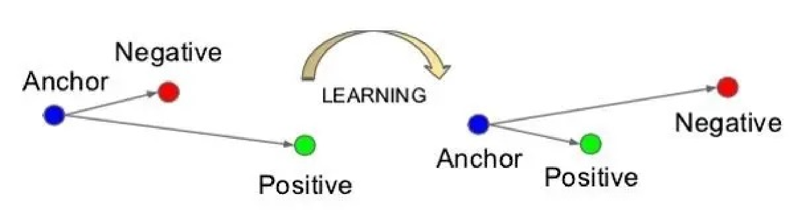
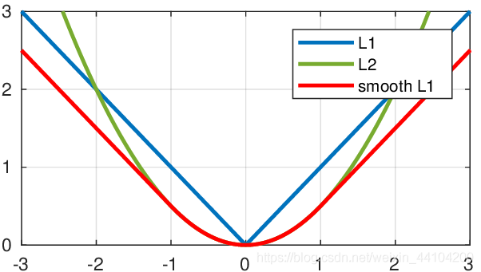

# 损失函数

损失函数：评价模型的预测值和真实值不一样的程度，损失函数越好，通常模型的性能越好。不同的模型用的损失函数一般也不一样。

- 经验风险损失函数：预测结果和实际结果的差别
- 结构风险损失函数：经验风险损失函数加上正则项

损失Loss必须是标量，因为向量无法比较大小（向量本身需要通过范数等标量来比较）

## 0-1损失函数

$$
L(y_i, f(x_i))=\left\{\begin{array}{l}
1, \mathrm{if}\;y_i \neq f(x_i) \\
0, \mathrm{if}\;y_i = f(x_i)
\end{array}\right.
$$

- 0-1损失可用于分类问题，但是由于该函数是非凸的，在最优化过程中求解不方便，有阶跃，不连续。0-1 loss无法对x进行求导，在依赖于反向传播的深度学习任务中，无法被使用，所以使用不多。

## Hinge Loss

主要用于支持向量机（SVM）中，它的称呼来源于损失的形状：
$$
l(f(x), y) = \max(0, 1 - yf(x))
$$
其中$y=\pm1$，$f(x)=wx+b$，当为SVM的线性核时。如果分类正确，loss=0，如果错误则为$1-f(x)$，所以它是一个分段不光滑的曲线。Hinge loss被用来解 SVM 中的间隔最大化问题。

## Softmax-loss 多分类

$$
L(y, z)=-\log(\frac{e^{z_y}}{\sum_je^{z_j}})=\log(\sum_je^{z_j})-z_j
$$

其中$\frac{e^{z_y}}{\sum_je^{z_j}}$是softmax函数计算的类别概率

使用Softmax分类的前提：==类别之间都是相互独立的==

Softmax分类的本质：将特征向量做归一化处理（输出总是和为1），将线性预测值转换为类别概率

## Logistic-loss 二分类交叉熵

$$
L(y', y) = -\frac{1}{m}\sum_{i=1}^my_i\log y_i'+(1-y_i)\log(1-y_i')
$$

Logistic 不使用平方损失的原因：平方损失会导致损失函数是非凸的，不利于求解，因为非凸函数会存在许多的局部最优解。

## Cross Entropy loss

cross entropy loss用于度量两个概率分布之间的相似性
$$
L=-\sum_{i=1}^my_i\log p_i
$$

- $y_i$为样本的真实标签，取值只能为0或1
- $p_i$为预测样本属于类别  的概率
- $m$为类别的数量

## Softmax cross entropy

如果概率是通过softmax计算得到的，那么就是softmax cross entropy
$$
L=-\sum_{k=1}^n\sum_{i=1}^cp_{k,i}\log q_{k,i}
$$

- $p_{k, i}$表示样本$k$属于类别$i$的概率（真实标签，只能为0或1）
- $q_{k,i}$表示Softmax预测的样本$k$属于类别$i$的概率
- $c$是类别数
- $n$是样本总数

## Triplet loss

用于训练==差异性较小==的样本，如人脸等。数据包括锚例、正例、负例，通过优化锚例与正例的距离小于锚例与负例的距离，实现样本的相似性计算。也就是说通过学习后，使得同类样本的 positive 更靠近Anchor，而不同类的样本Negative则远离Anchor。

- 从训练数据集中随机选一个样本，该样本称为Anchor，再随机选取一个与Anchor  (记为$x_a$)属于同一类的样本和不同类的样本,这两个样本对应的称为Positive (记为$x_p$)和Negative  (记为$x_n$)，由此构成一个（Anchor，Positive，Negative）三元组。

- 训练一个参数共享或不共享的网络，得到三个元素的特征表达：$f(x_i^a), f(x_i^p), f(x_i^n)$

- 使得Positive 和Anchor特征表达之间的距离尽可能小，而Anchor和Negative特征表达之间的距离尽可能大，并且要让$x_a$与$x_n$之间的距离和$x_a$与$x_p$之间的距离之间有一个最小的间隔$\alpha$，即：
  $$
  \Vert f(x_i^a)-f(x_i^p)\Vert_2^2+\alpha<\Vert f(x_i^a)-f(x_i^n)\Vert_2^2
  $$
  其中距离用欧式距离度量，$\alpha$也称为margin参数。设置一个合理的 margin 值很关键，这是衡量相似度的重要指标。

  - $\alpha$越小，loss 很容易趋近于 0 ，但很难区分相似的图像
  - $\alpha$越大，loss 值较难趋近于 0，甚至导致网络不收敛，但可以较有把握的区分较为相似的图像

目标函数：
$$
L=\max(0, \sum_i^N[\Vert f(x_i^a)-f(x_i^p)\Vert_2^2-\Vert f(x_i^a)-f(x_i^n)\Vert_2^2+\alpha])
$$
梯度推导：
$$
\frac{\partial L}{\partial f(x_i^a)}=2\cdot(f(x_i^a)-f(x_i^p))-2\cdot(f(x_i^a)-f(x_i^n))=2\cdot(f(x_i^n)-f(x_i^p))\\
\frac{\partial L}{\partial f(x_i^p)}=2\cdot(f(x_i^a)-f(x_i^p))\cdot(-1)=2\cdot(f(x_i^p)-f(x_i^a))\\
\frac{\partial L}{\partial f(x_i^n)}=-2\cdot(f(x_i^a)-f(x_i^n))\cdot(-1)=2\cdot(f(x_i^a)-f(x_i^n))
$$

- 在训练Triplet  Loss模型时，只需要输入样本，不需要输入标签，这样避免标签过多、同标签样本过少的问题，模型只关心样本编码，不关心样本类别
- Triplet  Loss在相似性计算和检索中的效果较好，可以学习到样本与变换样本之间的关联，检索出与当前样本最相似的其他样
- Triplet  Loss通常应用于个体级别的细粒度识别，比如分类猫与狗等是大类别的识别，但是有些需求要精确至个体级别，比如识别不同种类不同颜色的猫等，所以Triplet Loss最主要的应用也是在细粒度检索领域中

优点：

- 如果把不同个体作为类别进行分类训练，Softmax维度可能远大于Feature维度，精度无法保证
- Triplet Loss一般比分类能学习到更好的特征，在度量样本距离时，效果较好
- Triplet Loss支持调整阈值Margin，控制正负样本的距离，当特征归一化之后，通过调节阈值提升置信度

## MSE

均方误差（Mean Squared Error，MSE），也叫平方损失或 L2 损失，常用在最小二乘法中。它的思想是使得各个训练点到最优拟合线的距离最小（平方和最小）
$$
\mathrm{MSE}=\frac{1}{2m}\sum_{i=1}^m(y_i'-y_i)^2
$$
优点：MSE的函数曲线光滑、连续，处处可导，便于使用梯度下降算法，是一种常用的损失函数。 而且，随着误差的减小，梯度也在减小，这有利于收敛，即使使用固定的学习速率，也能较快的收敛到最小值。

缺点：当$y$和$f(x)$之间的差值大于1时，会放大误差；而当差值小于1时，则会缩小误差，这是平方运算决定的。MSE对于较大的误差($>1$)给予较大的惩罚，较小的误差$(<1)$给予较小的惩罚。也就是说，对离群点比较敏感，受其影响较大。如果样本中存在离群点，MSE会给离群点更高的权重，这就会牺牲其他正常点数据的预测效果，最终降低整体的模型性能，甚至可能引发梯度爆炸。

## MAE

**均绝对误差**（Mean Absolute Error，MAE）是所有单个观测值与算术平均值的绝对值的平均，也被称为L1损失，常用于回归问题中。与平均误差相比，平均绝对误差由于离差被绝对值化，不会出现正负相抵消的情况，因而，平均绝对误差能更好地反映预测值误差的实际情况。
$$
\mathrm{MAE}=\frac{1}{m}\sum_{i=1}^m|y_i'-y_i|
$$
优点：

- 无论对于什么样的输入值，都有着稳定的梯度，不会导致梯度爆炸问题，具有较为稳健性的解
- 对于离群点不那么敏感。因为MAE计算的是误差$y−f(x)$的绝对值，对于任意大小的差值，其惩罚都是固定的

缺点：MAE曲线连续，但是在$y−f(x)=0$处不可导。而且 MAE 大部分情况下梯度都是相等的，这意味着即使对于小的损失值，其梯度也是大的。这不利于函数的收敛和模型的学习。

由于L1 loss 具有稀疏性，为了惩罚较大的值，因此常常将其作为正则项添加到其他loss中作为约束

## Smooth L1 loss

$$
\mathrm{Smooth\ L1}(x)=\left\{\begin{array}{l}
0.5x^2, \mathrm{if}\;|x|<1 \\
|x|-0.5, \mathrm{otherwise}
\end{array}\right.
$$

Smooth L1能从两个方面限制梯度：

- 当估计值与ground truth差别过大时，梯度值不至于过大
- 当估计值与ground truth差别很小时，梯度值足够小

这样设置让loss对于离群点更加鲁棒，相比于L2损失函数，其对离群点、异常值不敏感，可控制梯度的量级使训练时不容易跑飞

